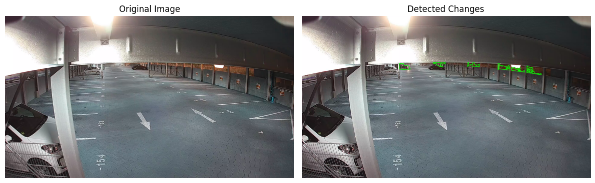
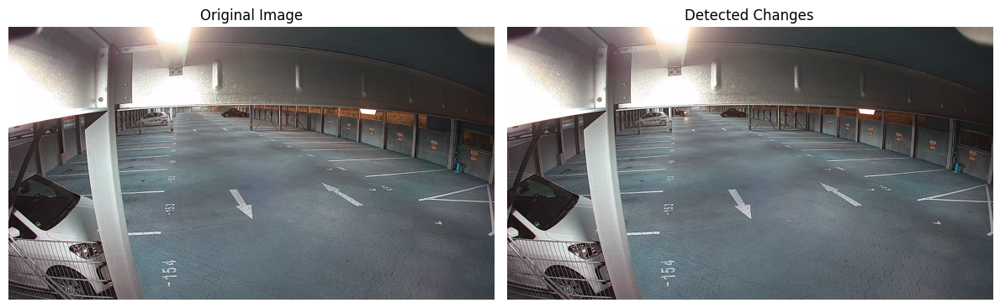
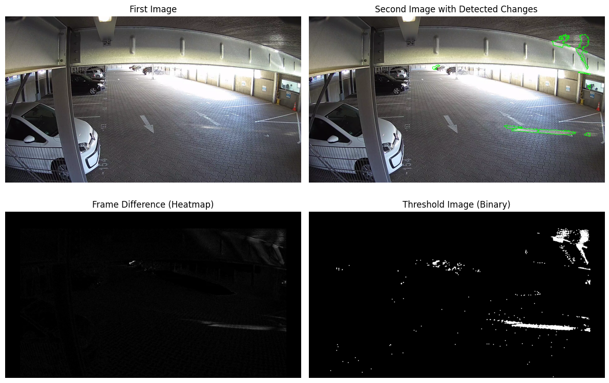
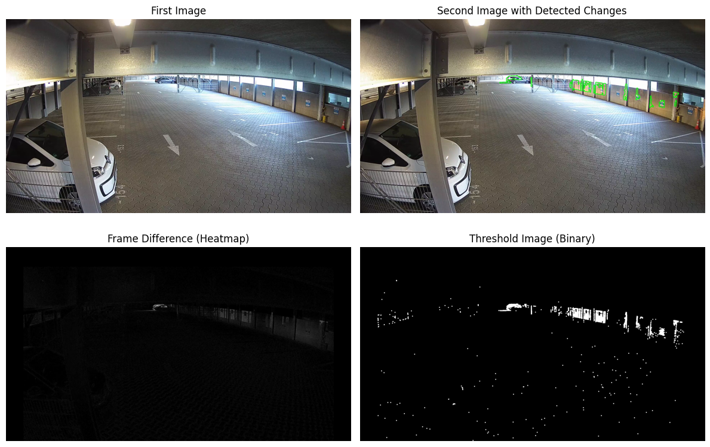
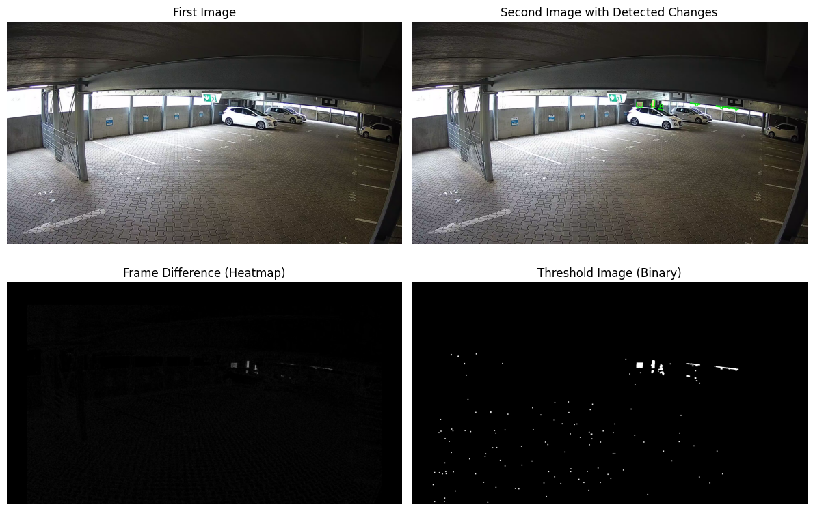
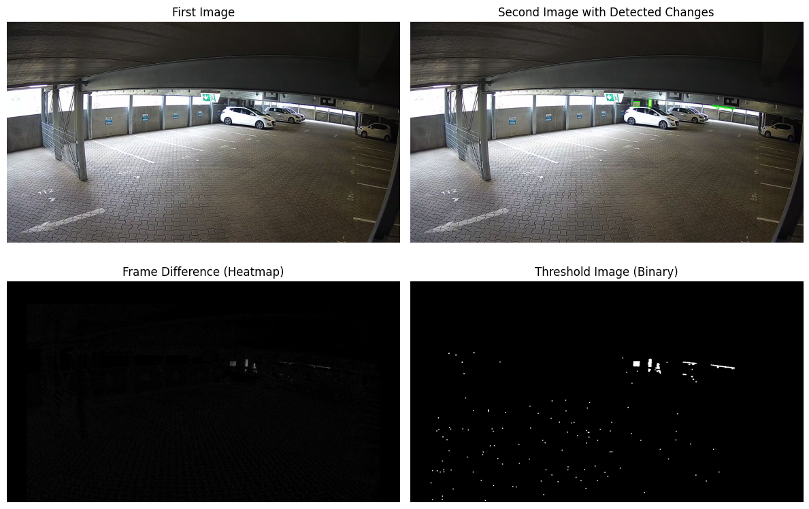
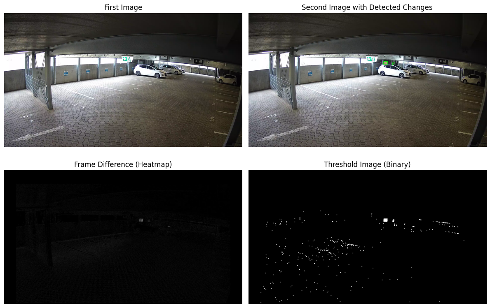
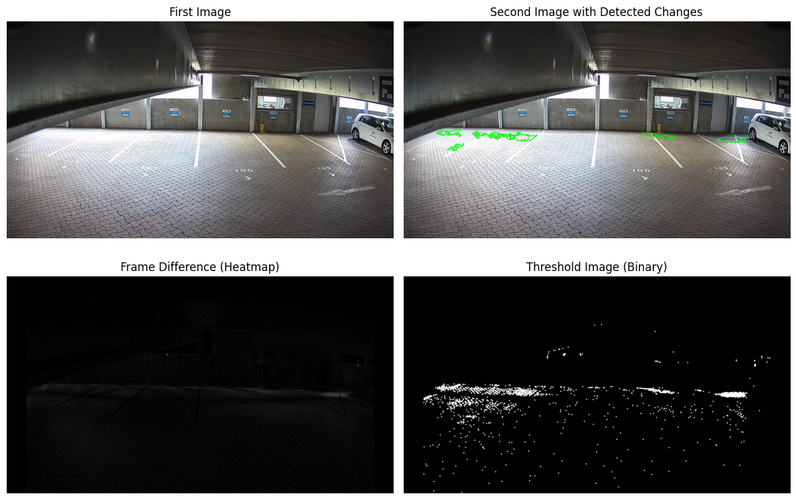
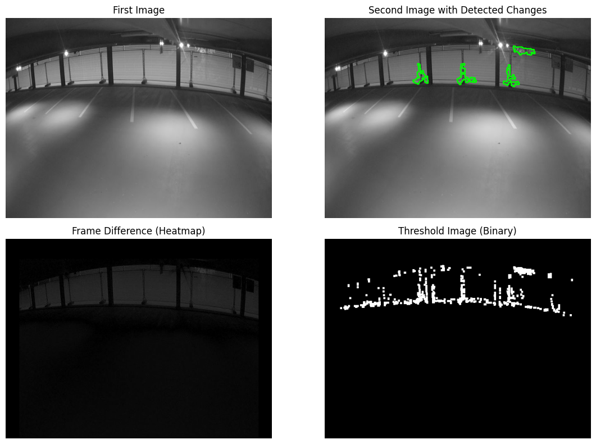
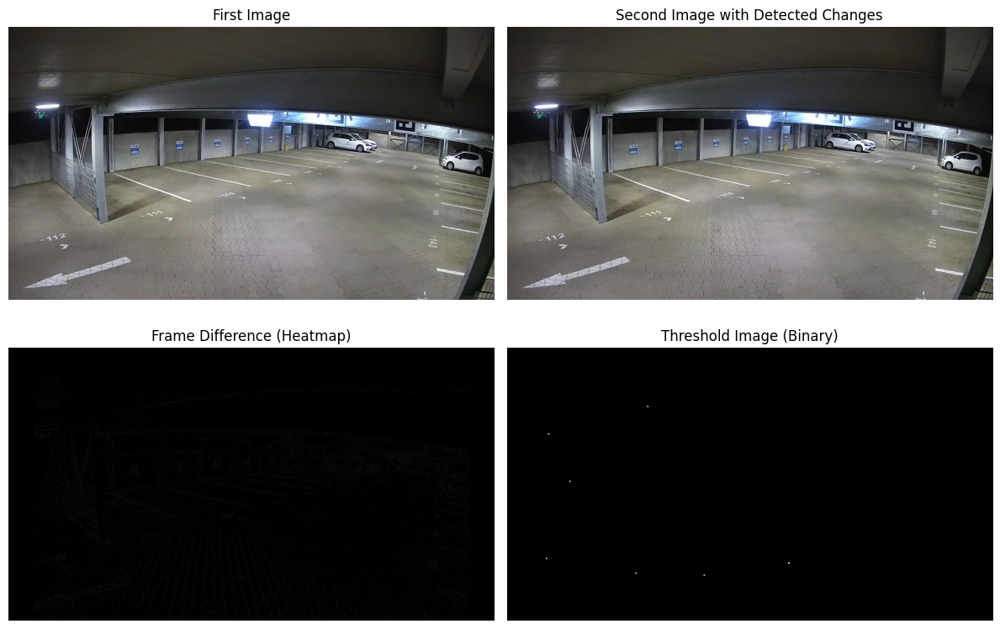

# Identify Duplicate Images
The aim of this project is to identify duplicate or extremely similar images within a dataset and remove them.

## 🚀 How to Use This Project
1. **Set the Images Folder Path**  
   - Open `main.py`.  
   - Specify the path to your images folder.  

2. **Run the Script**  
   - Execute the following command in your terminal:  
     ```sh
     python main.py
     ```

# 📊 Insights about Dataset  

### 📷 Number of Images per Camera ID  
| Camera ID | Number of Images |
|-----------|-----------------|
| **23**    | 484             |
| **20**    | 324             |
| **21**    | 146             |
| **10**    | 126             |

🔢 **Total Number of Images:** 1080  
🛠️ **Total Number of Images after Cleaning (Removing Invalid Images):** 1079  

---

### 🖼️ Image Resolutions Frequency  
| Camera ID | Resolution & Frequency                      |
|-----------|---------------------------------------------|
| **23**    | (1920, 1080) : 484                         |
| **20**    | (1920, 1080) : 324                         |
| **21**    | (1920, 1080) : 142 <br> (10, 6) : 1 <br> (1100, 619) : 1 <br> (1200, 675) : 1 |
| **10**    | (2688, 1520) : 12  <br> (640, 480) : 114   |

🛑 **Invalid Images Found:**  

'c21_2021_03_27__10_36_36.png'

---

### 📂 Image Filename Formats  
The dataset contains two distinct filename formats:  

1. **Milliseconds-based timestamp format:**  
   ```python
    c{camera_id}-{timestamp_ms}.png
    #c10-1623873231583.png

2. **YYYY-MM-DD__HH-MM-SS format:**  
   ```python
    c{camera_id}_YYYY-MM-DD__HH-MM-SS.png
    #c20_2021_04_27__12_38_53.png

# How Code Works 

## 🛠️ Preprocessing Dataset  

### 🔄 Steps in Preprocessing  
  
1️⃣ **Load and validate images**  
   - Skips invalid images that **cannot be loaded**.  
   - Keeps track of **invalid image filenames**.  

2️⃣ **Rename images to a standard format**  
   - Format:  
     - `c{camera_id}-{YYYYMMDDHHMMSS}.png`  
     - `c{camera_id}_{YYYYMMDDHHMMSS}.png` (for Camera ID **20** only)  
   - Unifying the timestamp allows for sorting the images by time.  
   ```python
      # Match different filename formats
      match_millis = re.match(r"c(\d+)-(\d{13})\.png", filename)  #c{camera_id}-{timestamp_ms}.png
      match_underscore = re.match(r"c(\d+)_(\d{4})_(\d{2})_(\d{2})__(\d{2})_(\d{2})_(\d{2})\.png", filename)  #c{camera_id}_YYYY-MM-DD__HH-MM-SS.png
      if match_millis:  # Convert ms timestamp to YYYYMMDDHHMMSS
         camera_id, timestamp_ms = match_millis.groups()
         timestamp = convert_to_yyyymmddhhmmss(timestamp_ms)
      elif match_underscore:  # Convert YYYY-MM-DD__HH-MM-SS to YYYYMMDDHHMMSS
         camera_id = match_underscore.group(1)
         timestamp = f"{match_underscore.group(2)}{match_underscore.group(3)}{match_underscore.group(4)}" \
                     f"{match_underscore.group(5)}{match_underscore.group(6)}{match_underscore.group(7)}"
      else:
         print(f"Skipping unrecognized file: {filename}")
         continue
   ```
   - In the dataset, **Camera ID 20** contains two sets of images with different **timestamp formats**, but both fall within the same timespan.  
    - **Unifying both formats** results in images from **Set A** being followed by images from **Set B** in sequence.  
    - This should work fine, but due to **data collection issues**, each switch between sets appears as a **different scene** rather than a continuous timeline.  
    - To resolve this, we **keep the two sets separated** by using distinct naming formats:  
     - **`c{camera_id}-{YYYYMMDDHHMMSS}.png`** for the first set.  
     - **`c{camera_id}_{YYYYMMDDHHMMSS}.png`** for the second set.  
     - This separation ensures the integrity of the sequence and prevents incorrect scene transitions.  

     ```python
      # Create the new filename in YYYYMMDDHHMMSS format
      if camera_id == "20" and match_underscore:
         new_filename = f"c{camera_id}_{timestamp}.png"
      else:
         new_filename = f"c{camera_id}-{timestamp}.png" 
     ```

4️⃣ **Sort images within each camera ID**  
     - Sorts images based on timestamp in filename keeping them **ordered chronologically**.  
   ```python
    # Sort the images within each camera_id dictionary based on the timestamp in new filenames
    for camera_id in images_by_camera_id:
        if camera_id == "20":
            # Separate filenames into two lists
            dash_images = {k: v for k, v in images_by_camera_id[camera_id].items() if k.startswith(f"c{camera_id}-")}
            underscore_images = {k: v for k, v in images_by_camera_id[camera_id].items() if k.startswith(f"c{camera_id}_")}
            # Sort each group based on the timestamp
            sorted_dash_images = dict(sorted(dash_images.items(), key=lambda item: item[0].split('-')[1]))
            sorted_underscore_images = dict(sorted(underscore_images.items(), key=lambda item: item[0].split('_')[1]))
            # Merge the sorted dictionaries
            sorted_images = {**sorted_dash_images, **sorted_underscore_images}
        else:
            # Sort the dictionary by the new filenames (timestamps)
            sorted_images = dict(sorted(images_by_camera_id[camera_id].items(), key=lambda item: item[0].split('-')[1]))
        # Update the images_by_camera_id dictionary with the sorted dictionary
        images_by_camera_id[camera_id] = sorted_images
   ```

5️⃣ **Store processed images in a dictionary**  
   - Organized as `{camera_id: {new_filename: old_filename}}`.  
   ```python
   Camera ID: 23
      c23-20210325171758.png -> c23-1616689078329.png
      c23-20210325171840.png -> c23-1616689120916.png
      c23-20210325171923.png -> c23-1616689163591.png
      c23-20210325172006.png -> c23-1616689206068.png
      c23-20210325172048.png -> c23-1616689248543.png
      ...
   Camera ID: 20
      c20-20210326152116.png -> c20-1616768476276.png
      c20-20210326152658.png -> c20-1616768818959.png
      c20-20210326153241.png -> c20-1616769161716.png
      c20-20210326153824.png -> c20-1616769504539.png
      c20-20210326154407.png -> c20-1616769847190.png
      ...
   Camera ID: 21
      c21-20210325161755.png -> c21_2021_03_25__16_17_55.png
      c21-20210325161837.png -> c21_2021_03_25__16_18_37.png
      c21-20210325162309.png -> c21_2021_03_25__16_23_09.png
      c21-20210325162852.png -> c21_2021_03_25__16_28_52.png
      c21-20210325170307.png -> c21_2021_03_25__17_03_07.png
      ...
   Camera ID: 10
      c10-20210616211818.png -> c10-1623871098865.png
      c10-20210616211844.png -> c10-1623871124416.png
      c10-20210616211928.png -> c10-1623871168398.png
      c10-20210616212512.png -> c10-1623871512458.png
      c10-20210616213056.png -> c10-1623871856393.png
      ...
   ```

## 📷 Comparing Images  

When comparing two images, we need to ensure they have the **same resolution** before applying change detection. This is important because the `cv2.absdiff()` function in `compare_frames_change_detection` will fail if the images have different dimensions.  

To address this, we:  
1. **Load the images** from the dataset using `load_image()`.  
2. **Ensure both images have the same resolution** by resizing the larger one to match the smaller one.  
3. **Preprocess the images** using the `preprocess_image_change_detection()` function.  
4. **Pass the preprocessed images** to `compare_frames_change_detection()` to compute changes.  

### 🛠️ Resizing to Match Dimensions  

Before processing, we compare the image sizes and **resize the larger image** to match the smaller one using `cv2.INTER_NEAREST`. This interpolation method is chosen because it preserves sharp edges and avoids blurring when downscaling.  

```python
# Determine which image is larger and resize it to match the smaller one
if first_image.shape != second_image.shape:
    # Get the target dimensions (smaller image)
    target_height = min(first_image.shape[0], second_image.shape[0])
    target_width = min(first_image.shape[1], second_image.shape[1])

    # Resize the larger image
    if first_image.shape[0] > second_image.shape[0] or first_image.shape[1] > second_image.shape[1]:
        first_image = cv2.resize(first_image, (target_width, target_height), interpolation=cv2.INTER_NEAREST)
    else:
        second_image = cv2.resize(second_image, (target_width, target_height), interpolation=cv2.INTER_NEAREST)
```
## 🔍 Detecting Significant Changes  

To filter out **duplicate images** for each specific camera, we follow this process:  
  - **Initialize the reference image** as the first image in the sequence.  
  - Iterate over the subsequent images and **compare each one** with the reference image. 
  ```python
    # Dictionary to store images that trigger a reference update
    change_log = {}

    # First reference image
    reference_img = next(iter(images_by_camera_id[camera_id]))  # Get the first key (new filename)

    # Iterate through the images for the given camera ID
    for to_compare_img in images_by_camera_id[camera_id]:
        # Skip the reference image
        if to_compare_img != reference_img:
            # Compare images
            score, _, _ = compare_images(image_folder, camera_id, images_by_camera_id, reference_img, to_compare_img)
        else:
            continue

        if score == -1:
            print(f"Error comparing images {reference_img} and {to_compare_img}. Skipping...")
            continue
  ``` 
  - If the **comparison score exceeds the defined threshold**, the image that triggered this change is:  
    - **Stored in a dictionary** to be preserved.  
    - **Marked as the new reference image**.  
  - All images between the **previous reference image** and the new one are **removed**.  
  - The process continues until all images have been checked.  
  ```python
        # If the change score exceeds the threshold, update the reference image
        if score > change_threshold:
            print(f"Significant change detected ({score} > {change_threshold}). Updating reference image.")
            # Update the reference image
            reference_img = to_compare_img
            # Store the image and score in dictionary
            change_log[to_compare_img] = score

  ```

# 📌 Case Scenarios: Understanding Change Scores  

To better understand how the **change score** relates to actual differences in images, various image pairs were analyzed. This helps in fine-tuning input parameters **min_contour_area** and **change_threshold** for optimal change detection. The experiments can be found in [**explore-dataset.ipynb**](explore_dataset.ipynb)  

## Physical Changes

The goal is to find the **min_contour_area** value that allows for the detection of the smallest physical changes but also try to maximize since the lower the **min_contour_area** is, the more noise or trivial changes are detected which leads to more duplicate images not being detected. 

### **Scenario 1**: car appearing in far background
- **First Image**: c23-1616689078329.png  
- **Second Image**: c23-1616689120916.png  
   - **min_contour_area**: 1000
   - **change score**: 8611.0

   - **min_contour_area**: 5000
   - **change score**: 0

- **Observation**:  
  - **min_contour_area**: 5000 fails to detect the car appearing in the background
  - **min_contour_area**: 1000 detects the car but also some nose from lighting conditions as difference

### **Scenario 2**: car leaving parking in far background
- **First Image**: c20_2021_04_27__15_01_42.png  
- **Second Image**: c20_2021_04_27__15_07_24.png 
   - **min_contour_area**: 200
   - **change score**: 23315.0

   - **min_contour_area**: 500
   - **change score**: 22584.5

- **Observation**:  
  With both values, the physical change is successfully detected with no big difference in change score

### **Scenario 3**: car appearing in far background
- **First Image**: c20_2021_04_28__04_20_18.png  
- **Second Image**: c20_2021_04_28__04_26_00.png 
   - **min_contour_area**: 200
   - **change score**: 14419.0

   - **min_contour_area**: 500
   - **change score**: 13065.5

- **Observation**:  
  Same as case 2, the physical change is successfully detected for both values with no big difference in change score

### **Scenario 4**: very small physical changes
- **First Image**: c23-1616689078329.png  
- **Second Image**: c23-1616689120916.png 
   - **min_contour_area**: 200
   - **change score**: 2701.0

   - **min_contour_area**: 500
   - **change score**: 2034.0

- **Observation**:  
   - **min_contour_area**: 200 detects all physical changes
   - **min_contour_area**: 500 fails to detect one small change

### **Scenario 5**: very small physical changes too
- **First Image**: c23-1616689392406.png  
- **Second Image**: c23-1616689734969.png 
   - **min_contour_area**: 200
   - **change score**: 1063.5

   - **min_contour_area**: 500
   - **change score**: 800.0

- **Observation**:  
   - **min_contour_area**: 200 detects all physical changes
   - **min_contour_area**: 500 fails to detect one small change


## Light Conditions

Now analyzing the effect of varying light conditions on the **change score** 

### **Scenario 6**: images look the same to human eye
- **First Image**: c21_2021_03_26__10_10_01.png  
- **Second Image**: c21_2021_03_26__10_15_44.png 
   - **min_contour_area**: 500
   - **change score**: 12313.0

- **Observation**:  
  **change score** is relatively high compared to previous cases although no physical changes can be seen

### **Scenario 7**: images looks the same to human eye too
- **First Image**: c10-1623872544167.png  
- **Second Image**: c10-1623872887821.png 
   - **min_contour_area**: 500
   - **change score**: 2525.5

- **Observation**:  
  **change score** is lower than the previous case but still high enough to match some small physical changes we had

### **Scenario 8**: duplicate found
- **First Image**: c23-1616709249289.png  
- **Second Image**: c23-1616709591253.png 
   - **min_contour_area**: 200
   - **change score**: 0

- **Observation**:  
  **change score** very slight changes in light conditions that are not even detected at all

# 📊 Results

### 🔹 **For min_contour_area = 500 and change_threshold = 2000**

| 📷 Camera ID | 🖼️ Total Images | ✅ Unique Images | ❌ Duplicates Removed |
|-------------|---------------|----------------|----------------------|
| 23          | 484           | 216            | 268                  |
| 20          | 324           | 322            | 2                    |
| 21          | 145           | 144            | 1                    |
| 10          | 126           | 37             | 89                   |

---

### 🔹 **For min_contour_area = 200 and change_threshold = 800**

| 📷 Camera ID | 🖼️ Total Images | ✅ Unique Images | ❌ Duplicates Removed |
|-------------|---------------|----------------|----------------------|
| 23          | 484           | 249            | 235                  |
| 20          | 324           | 323            | 1                    |
| 21          | 145           | 144            | 1                    |
| 10          | 126           | 39             | 87                   |

## ✅ Validation  

To efficiently verify whether **duplicate images** are correctly identified, we generate a **video** for each Camera ID, where images are played in **chronological order**. This allows for a **quick visual inspection** of how duplicates are detected and removed.  

### 🔍 **How It Works:**  
- 📸 **Each image** is displayed in the video in the order it was captured.  
- 🔴 **Red label (top-left)**: Indicates that the image is identified as a **duplicate** and will be **removed**.  
- 🟢 **Green label (top-left)**: Indicates that the image is **unique** and will be **kept**.  
- 🎞️ This approach makes it **easy to spot inconsistencies** or confirm that duplicates are correctly flagged.  

### 🎥 **Example Video:**  
> Below is a sample validation video for **Camera ID 23**, where images are played in sequence with their duplicate status labeled:  

  

This method provides an **intuitive** and **efficient** way to ensure that image filtering works as expected! 🚀  

# ✨ **Key Insights & Possible Improvements**  

### 🔍 **Key Insights**  
- 📸 **Most duplicates** were found in **Camera 10** and **Camera 23** because their streams extend **into the night**.  
  - 🌙 **Less movement** at night means fewer changes between frames.  
  - 💡 **Less light variation** reduces natural differences, making duplicate detection easier.  
  - 🌞 **Cameras 20 & 21** mostly captured images **during daylight hours**, where:  
  - ☀️ **Sunlight fluctuations** introduced unintended variations.  
  - 🔄 Even when there was **no movement**, changes in brightness made images seem different.  
  - An important question to be answered is what is considered as minor changes and how much we tolerate them, because this can affect choosing the **min_contour_area** and **change_threshold** parameters. In this case I dealt with any physical movement as important no matter how small (like car exiting the parking in the very far background), but if more flexibility is possible then the parameters can be set higher and more similarly alike images can be identified. 

#### 🚀 **Possible Improvements**  
Finding ways to mitigate the **effect of sunlight** would improve **duplicate detection**. For example, installing sunshades can be helpful to reduce sunlight fluctuations since I believe that the images would then be easier to process and work with. 